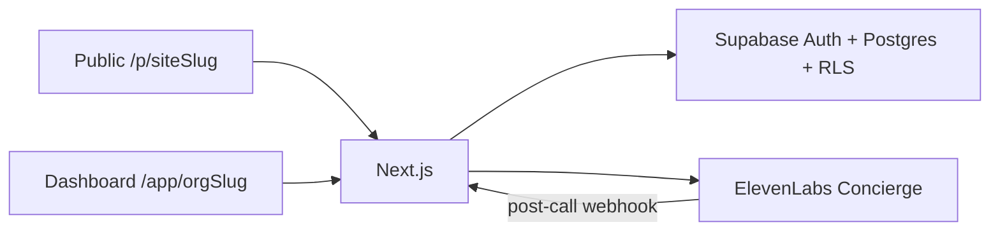

# flippinCalendar — AI Receptionist & Front-Desk SaaS

[](https://nextjs.org/)
[](https://supabase.com/)
[](https://elevenlabs.io/)
[](https://tailwindcss.com/)
[](https://www.typescriptlang.org/)

A multi-tenant **AI front-desk / receptionist SaaS**: branded public booking pages, an ElevenLabs voice + text concierge that books appointments live, and a tenant-scoped staff dashboard.

> **Stack** — Next.js 16 App Router · React 19 · Supabase Auth + Postgres + RLS · ElevenLabs Conversational AI · shadcn/ui · Tailwind CSS v4 · TypeScript strict

**Production domain:** [`flippincalendar.co.za`](https://www.flippincalendar.co.za)

---

## Accounts you need

| Service | Role |
| ------- | ---- |
| [Supabase](https://supabase.com/) | Auth, Postgres, Row Level Security |
| [ElevenLabs](https://elevenlabs.io/) | Shared Concierge voice/text agent |

---

## Two identity worlds

- **Dashboard** (`/app/[orgSlug]`) — staff signed in with Supabase Auth. One user → one personal workspace.
- **Public page** (`/p/[siteSlug]`) — anonymous visitors booking. No auth session. Public API routes + RLS-safe reads only.

One **shared ElevenLabs Concierge** serves every tenant. Per-org persona, voice, greeting, and knowledge are injected at **session time** (signed URL + dynamic variables + overrides). Do **not** PATCH the shared agent per organization.

---

## Quick start

```bash
pnpm install
cp .env.example .env.local
# Fill Supabase URL + keys, ElevenLabs, NEXT_PUBLIC_APP_URL
pnpm dev
```

### Required env (see `.env.example`)

```bash
NEXT_PUBLIC_SUPABASE_URL=https://<project-ref>.supabase.co
NEXT_PUBLIC_SUPABASE_PUBLISHABLE_KEY=sb_publishable_your_key
SUPABASE_SECRET_KEY=sb_secret_your_key

NEXT_PUBLIC_APP_URL=http://localhost:3000

ELEVENLABS_API_KEY=your_api_key_here
ELEVENLABS_DEFAULT_AGENT_ID=agent_5101kyk31534e7bb4vp8v2x4dae3
ELEVENLABS_WEBHOOK_SECRET=your_elevenlabs_webhook_hmac_secret
```

Apply SQL migrations from `supabase/migrations/` in the Supabase SQL editor or CLI before first run.

---

## Architecture



- **Auth:** Supabase Auth (email/password). Sessions stored in cookies via `@supabase/ssr`.
- **Data:** Supabase Postgres with tenant-scoped RLS (`organization_id`).
- **Concierge:** Versioned config under `agent_configs/` + `agents.json`; session routes under `/api/app/agent-session` and `/api/public/[siteSlug]/agent-session`.

---

## Scripts

| Command | Purpose |
| ------- | ------- |
| `pnpm dev` | Next.js dev server |
| `pnpm build` / `pnpm start` | Production build / serve |
| `pnpm test` | Vitest |
| `pnpm run typecheck` / `pnpm run check` | TS + ESLint |

---

## Production

1. Set `NEXT_PUBLIC_APP_URL=https://www.flippincalendar.co.za`.
2. Configure Supabase production keys.
3. Point ElevenLabs webhook to `https://www.flippincalendar.co.za/api/webhooks/elevenlabs`.
4. Smoke-test signup → workspace → publish → book → Orb → webhook.